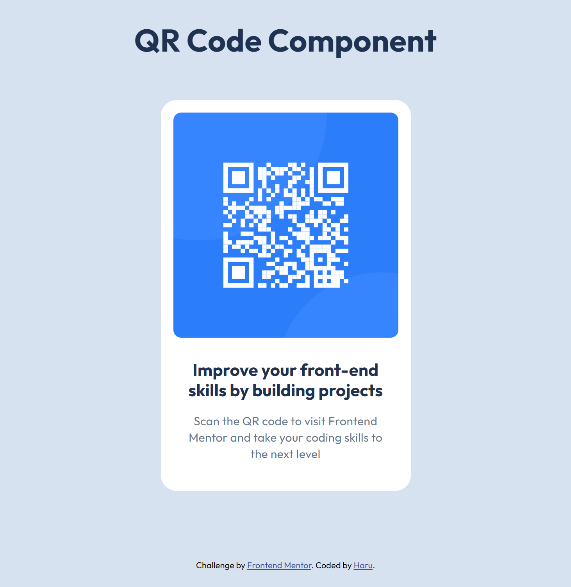

# Frontend Mentor - QR code component solution

This is a solution to the [QR code component challenge on Frontend Mentor](https://www.frontendmentor.io/challenges/qr-code-component-iux_sIO_H). Frontend Mentor challenges help you improve your coding skills by building realistic projects. 

## Table of contents

- [Overview](#overview)
  - [Screenshot](#screenshot)
  - [Links](#links)
- [My process](#my-process)
  - [Built with](#built-with)
  - [What I learned](#what-i-learned)
- [Author](#author)

## Overview

My Solution to QR code component challenge

### Screenshot

### Links

- Solution URL: [Solution](https://www.frontendmentor.io/solutions/qr-code-component-sgenvR7rV7)
- Live Site URL: [Live Site](https://phtm-haru.github.io/fem-qr-code-component/)

## My process

### Built with

- CSS Grid
- Mobile-first workflow

### What I learned

I learned about using CSS Grid Area

## Author

- Frontend Mentor - [@phtm-haru](https://www.frontendmentor.io/profile/phtm-haru)
